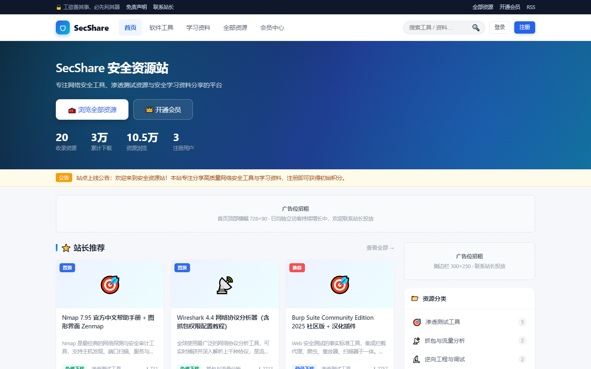
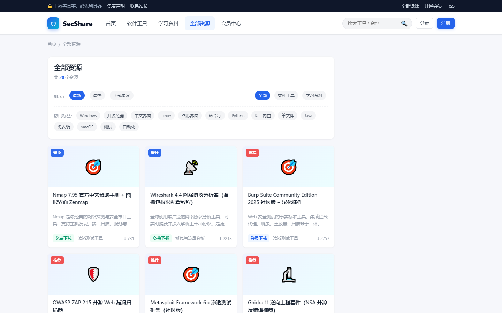
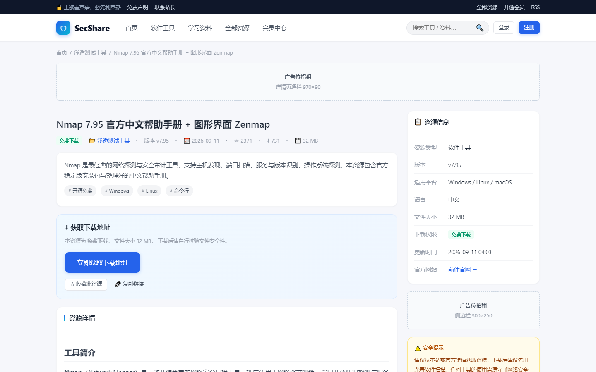
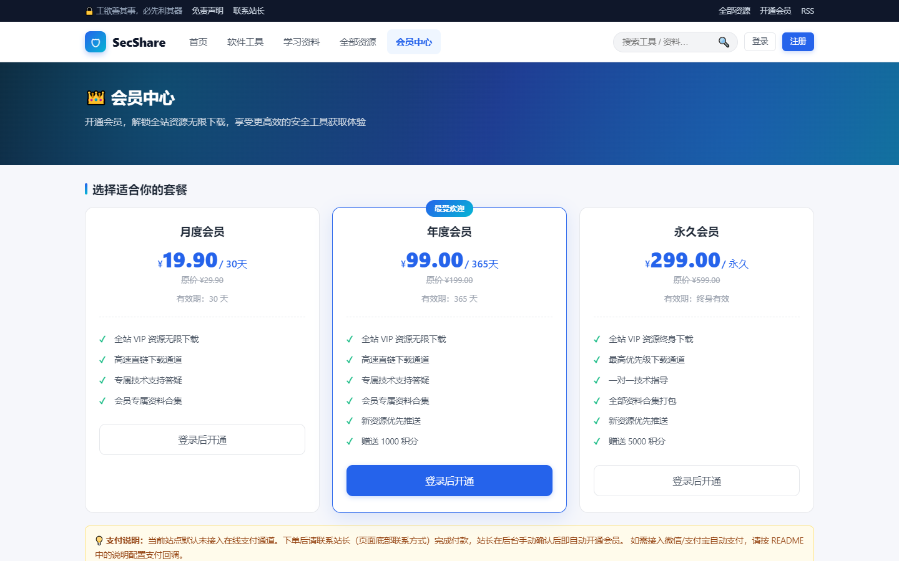
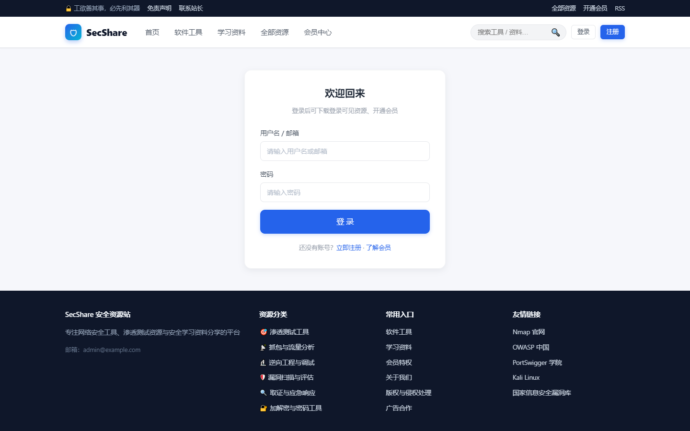
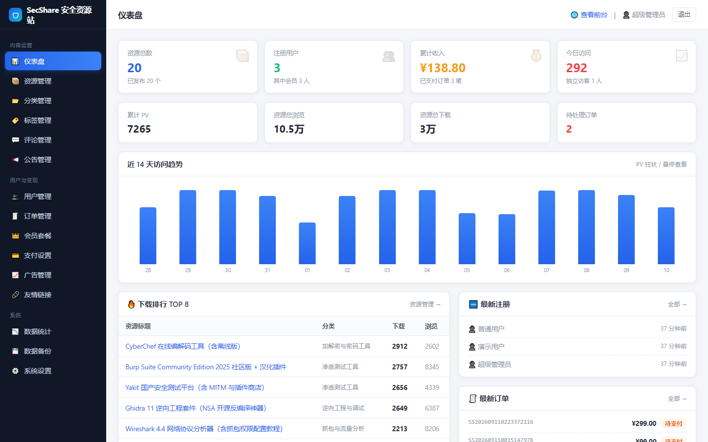
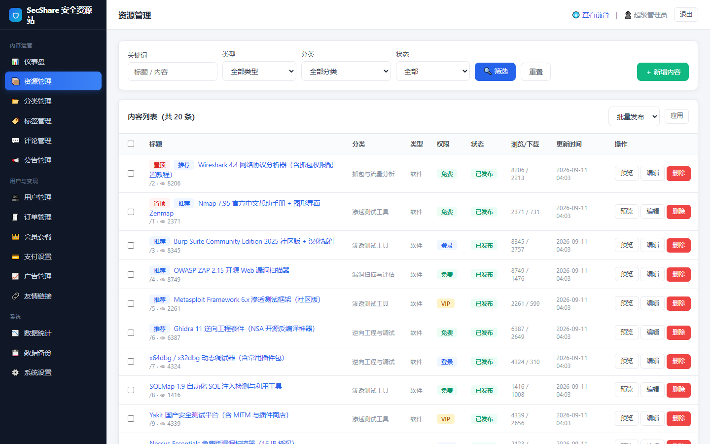
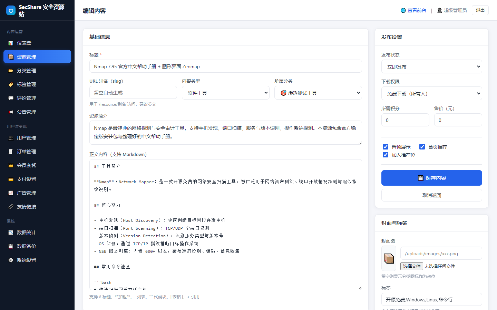
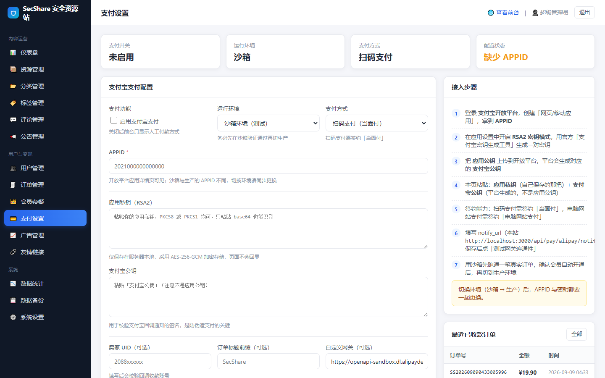
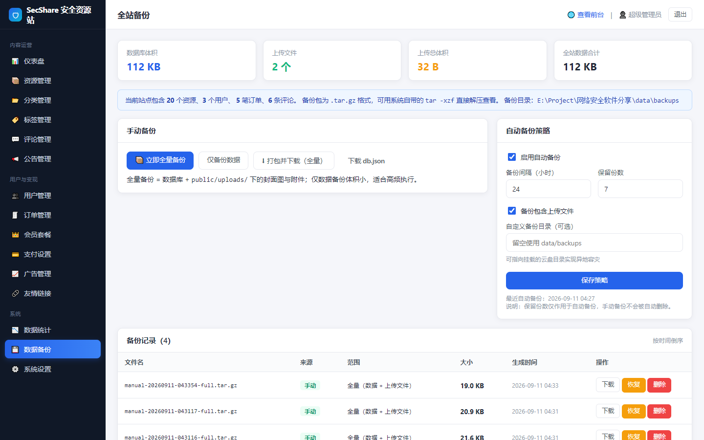

<div align="center">

# SecShare · 网络安全资源分享平台

**一个开箱即用的网络安全软件 / 资料分享站，自带管理后台、会员体系、支付宝收款与全站备份**

参考 `ycc77.cn`、`果核剥壳(ghxi.com)` 的内容组织方式实现 · 服务端渲染，对 SEO 友好 · 零原生依赖，Windows / Linux 直接跑


</div>

---

## 📸 界面预览

### 前台

**首页**：数据看板 + 站长推荐 + 最新上架 + 分类导航 + 广告位



| 资源库（筛选 / 排序 / 分页） | 资源详情（含下载区与权限控制） |
| --- | --- |
|  |  |

| 会员套餐与权益对比 | 用户中心 |
| --- | --- |
|  |  |

### 后台管理

**仪表盘**：资源 / 用户 / 收入 / 流量总览、14 天访问趋势、下载榜、最新注册与订单



| 资源管理 | 资源编辑（Markdown + 多下载线路） |
| --- | --- |
|  |  |

| 支付宝支付设置 | 全站备份 |
| --- | --- |
|  |  |

---

## ✨ 功能特性

### 前台

- **首页**：首屏数据看板、站长推荐、最新上架、学习资料分区、热门下载榜
- **资源库**：按分类 / 标签 / 类型筛选，支持「最新 / 最热 / 下载最多」排序与分页
- **搜索**：标题、简介、正文、标签全文匹配
- **资源详情**：Markdown 正文（标题/列表/代码块/表格/引用）、资源信息表、标签、相关推荐、评论、收藏
- **下载中心**：多线路下载、提取码、解压密码、文件校验值（SHA256/MD5）
- **五级下载权限**：`免费` / `登录可见` / `积分兑换` / `VIP 专享` / `单独付费`
- **会员中心**：套餐展示、权益对比表、在线下单、**支付宝在线支付**
- **用户中心**：资料修改、修改密码、我的订单、收藏夹、下载记录、站内通知
- **内容页面**：关于我们、免责声明、版权与侵权处理、联系我们
- **SEO**：`sitemap.xml`、`robots.txt`、`rss.xml`、语义化 meta、第三方统计代码注入

### 后台管理（`/admin`，14 个模块）

| 模块 | 能力 |
| --- | --- |
| 仪表盘 | 资源/用户/收入/今日流量总览，14 天访问趋势图，下载排行，最新注册与订单 |
| 资源管理 | 新增 / 编辑 / 删除、批量发布·草稿·置顶·推荐、多下载线路、封面与附件上传、Markdown 正文 |
| 分类管理 | 增删改、图标、排序、说明 |
| 标签管理 | 增删、自动统计关联资源数 |
| 评论管理 | 查看、删除；前台评论开关 |
| 用户管理 | 搜索、编辑资料、调整积分、封禁/解封、赠送会员、重置密码 |
| 订单管理 | 状态筛选、确认收款（自动开通会员）、取消、删除 |
| 会员套餐 | 增删改、价格 / 时长 / 等级 / 权益列表 / 上下架 / 推荐标记 |
| **支付设置** | 支付宝沙箱·生产切换、APPID、应用私钥与支付宝公钥（加密存储）、扫码或电脑网站支付、连通性自检、支付日志 |
| 广告管理 | 4 个广告位（首页顶部 / 侧边栏 / 详情页顶部 / 右下角悬浮），支持图片或自定义 HTML 广告联盟代码，含曝光统计 |
| 公告 / 友情链接 | 增删改、置顶、排序、显示开关 |
| 数据统计 | 30 天 PV/UV 趋势、浏览榜、下载榜、每日明细 |
| **全站备份** | 一键全量 / 仅数据备份、打包下载、上传恢复、按文件恢复、自动定时备份、保留份数滚动清理 |
| 系统设置 | 站点信息、SEO、联系方式、功能开关、变现开关、法律文本 |

---

## 🧱 技术栈与设计取舍

| 维度 | 选择 | 为什么 |
| --- | --- | --- |
| 服务端 | Node.js + Express 4 | 生态成熟、部署简单，Windows 也能直接跑 |
| 模板 | EJS 服务端渲染 | 资源站靠搜索流量，服务端渲染对 SEO 明显更友好 |
| 数据层 | 自研单文件 JSON（原子写 + 内存缓存） | **零原生依赖**，避免 `better-sqlite3` 之类的编译问题；备份就是复制一个文件 |
| 会话 | 自签 token 存数据表 | 不用 `express-session` 的 MemoryStore，进程重启不掉线 |
| 密码 | `node:crypto` scrypt | 与 bcrypt 同级别的安全强度，且无需额外依赖 |
| 支付 | `node:crypto` 手写 RSA2 | 不依赖支付宝 SDK，签名验签规则完全透明可控 |
| 备份 | 手写 tar + zlib gzip | 无需外部命令，Windows / Linux 都能用系统自带 `tar` 解压，gzip 自带 CRC32 校验 |
| 生产依赖 | 仅 4 个纯 JS 包 | `express` / `ejs` / `multer` / `qrcode` |

> 数据量增长到十万条以上时，把 `src/db/store.js` 换成 SQLite / MySQL 驱动即可，上层业务代码无需改动。

---

## 🚀 快速开始

### 环境要求

- **Node.js ≥ 18**（推荐 20 / 22 LTS），`node -v` 能输出版本号即可
- npm（随 Node 自带）
- 不需要数据库、不需要编译工具链

### 三步跑起来

```bash
# 1. 安装依赖
npm install

# 2. 启动服务
npm start

# Windows 上如果提示端口被占用，可换端口启动：
# PORT=8080 npm start
```

启动成功后终端会打印访问地址与初始账号：

```
──────────────────────────────────────────────────────────
  SecShare 安全资源站 已启动
──────────────────────────────────────────────────────────
  前台首页   http://localhost:3000/
  后台管理   http://localhost:3000/admin
  数据文件   .../data/db.json

  已写入初始数据
  管理员账号 admin / admin888  ← 请登录后立即修改
  演示用户   demo / demo1234（年费会员）、freeuser / free1234（普通用户）
──────────────────────────────────────────────────────────
```

### 访问入口与初始账号

| 入口 | 地址 | 账号 |
| --- | --- | --- |
| 前台首页 | http://localhost:3000/ | 演示用户 `demo / demo1234`（年费会员）<br>`freeuser / free1234`（普通用户） |
| 管理后台 | http://localhost:3000/admin | `admin / admin888` |

> ⚠️ **首次登录后请立刻到「用户管理」修改管理员密码**。

### 常用命令

```bash
npm start          # 启动服务
npm run dev        # 开发模式（文件变更自动重启）
npm test           # 端到端冒烟测试（126 项）
npm run test:unit  # 单元自测（29 项）
npm run seed       # 重新写入初始数据（不覆盖已有数据）
npm run reset      # 清空并重建初始数据（危险操作）
npm run shots      # 重新生成文档截图（需先启动服务）
```

---

## ⚙️ 环境变量

全部可选，用环境变量覆盖默认配置：

| 变量 | 默认值 | 说明 |
| --- | --- | --- |
| `PORT` | `3000` | 服务端口 |
| `HOST` | `0.0.0.0` | 监听地址 |
| `SESSION_SECRET` | `change-this-secret-in-production` | **生产必改**。会话签名密钥，同时用于加密支付私钥 |
| `SESSION_DAYS` | `14` | 登录态有效期（天） |
| `ADMIN_USER` / `ADMIN_PASS` | `admin` / `admin888` | 仅首次初始化数据时使用 |
| `TRUST_PROXY` | 关 | 部署在 Nginx 后面时设为 `1`，才能取到真实访客 IP |
| `UPLOAD_MAX_MB` | `512` | 单个上传文件上限（MB） |

> ⚠️ `SESSION_SECRET` 一旦改动，已保存的支付密钥将无法解密（后台会明确提示「密钥已失效，请重新填写」）。上线前定好，之后别动。

生产启动示例：

```bash
SESSION_SECRET=$(openssl rand -hex 32) TRUST_PROXY=1 PORT=3000 npm start
```

---

## 🌐 生产部署

### 方案一：PM2 守护进程（推荐）

```bash
# 服务器安装 Node.js 18+ 后，上传代码
npm install --production

# 全局安装 PM2
npm i -g pm2

# 启动并守护
SESSION_SECRET=$(openssl rand -hex 32) TRUST_PROXY=1 pm2 start server.js --name secshare

# 开机自启
pm2 save && pm2 startup

# 查看日志
pm2 logs secshare
```

### 方案二：systemd（纯 Linux 环境）

```ini
# /etc/systemd/system/secshare.service
[Unit]
Description=SecShare
After=network.target

[Service]
Type=simple
WorkingDirectory=/opt/secshare
Environment=NODE_ENV=production
Environment=PORT=3000
Environment=TRUST_PROXY=1
Environment=SESSION_SECRET=换成你自己的随机字符串
ExecStart=/usr/bin/node server.js
Restart=always
RestartSec=5
User=www-data

[Install]
WantedBy=multi-user.target
```

```bash
systemctl daemon-reload && systemctl enable --now secshare
```

### Nginx 反向代理 + HTTPS

```nginx
server {
    listen 80;
    server_name your-domain.com;
    return 301 https://$host$request_uri;
}

server {
    listen 443 ssl http2;
    server_name your-domain.com;

    ssl_certificate     /etc/letsencrypt/live/your-domain.com/fullchain.pem;
    ssl_certificate_key /etc/letsencrypt/live/your-domain.com/privkey.pem;

    # 需要大于站点上传上限（含资源包上传）
    client_max_body_size 600m;

    location / {
        proxy_pass http://127.0.0.1:3000;
        proxy_http_version 1.1;
        proxy_set_header Host              $host;
        proxy_set_header X-Real-IP         $remote_addr;
        proxy_set_header X-Forwarded-For   $proxy_add_x_forwarded_for;
        proxy_set_header X-Forwarded-Proto $scheme;
    }
}
```

证书可用 Let's Encrypt 免费申请：

```bash
sudo apt install certbot python3-certbot-nginx
sudo certbot --nginx -d your-domain.com
```

### 上线检查清单

- [ ] 修改管理员默认密码
- [ ] 设置 `SESSION_SECRET`（随机 32 字节）与 `TRUST_PROXY=1`
- [ ] 后台「系统设置」把**站点域名**改为正式域名（影响 sitemap / RSS / 支付宝回调地址）
- [ ] 配置 `Nginx client_max_body_size`，与上传上限匹配
- [ ] 配置自动备份，并把备份目录指向异地存储
- [ ] 用浏览器实际走一遍：注册 → 下单 → 支付 → 会员生效 → 下载

---

## 💰 变现方式

### 1）会员订阅（主力收入）

1. 后台 →「会员套餐」设置价格与权益（默认已配好 月卡 ¥19.9 / 年卡 ¥99 / 永久 ¥299 三档）
2. 发布核心资源时把「下载权限」设为 **VIP 专享**
3. 收款方式二选一：
   - **自动收款**：配置支付宝后，用户扫码支付 → 系统验签回调 → **自动开通会员**，全程无需人工
   - **人工收款**：用户下单后联系你付款，你在「订单管理」点 **确认收款** 即可开通

### 2）广告位售卖

- 后台 →「广告管理」共 4 个位置：首页顶部横幅、侧边栏、详情页顶部、右下角悬浮
- 两种玩法：
  - **直接招商**：只填「备注文字」，前台显示「广告位招租」占位，方便报价洽谈
  - **挂联盟广告**：形式选「自定义代码」，粘贴百度联盟 / AdSense 等脚本
- 悬浮广告对体验与搜索排名有影响，建议默认关闭，仅在活动期开启

### 3）辅助收入

- **资源投稿**：收录原创工具/教程，用积分或会员时长作为稿酬
- **积分体系**：注册送积分、VIP 赠积分，用「积分兑换」权限的资源承接，提高停留与复购

---

## 💳 支付宝支付接入

签名 / 验签 / 下单 / 查单 / 回调校验 / 二维码生成**全部已实现**，你只需要填 3 个值。**

### 接入步骤

1. **创建应用**：登录 [支付宝开放平台](https://open.alipay.com/) → 创建「网页/移动应用」→ 拿到 **APPID**
2. **生成密钥**：用官方「支付宝密钥生成工具」生成一对 RSA2 密钥（应用私钥 + 应用公钥）
3. **上传公钥**：在开放平台上传 **应用公钥**，平台会自动生成对应的 **支付宝公钥**
4. **签约能力**：
   - 扫码支付（当面付）→ 签约「当面付」
   - 电脑网站支付 → 签约「电脑网站支付」
5. **填入后台**：后台 →「支付设置」→ 填 `APPID`、`应用私钥`、`支付宝公钥`（⚠️ 不是应用公钥），选择支付方式，保存
6. **配置回调地址**：把 `https://你的域名/api/pay/alipay/notify` 填入「异步通知地址」（留空则自动用站点域名拼接）
7. **自检**：点「测试网关连通性」，返回「签名校验通过」即配置正确
8. **沙箱验证**：先用沙箱环境（沙箱模式 + 沙箱 APPID/密钥）完整跑一笔订单，确认会员自动开通后再切换生产

> 私钥支持 PKCS8、PKCS1 以及纯 base64 三种粘贴方式，程序会自动识别。

### 支付流程

```
用户下单 ──▶ /pay/订单号 ──▶ 扫码 / 跳转收银台 ──▶ 支付宝付款
                                                        │
              ┌─────────────────────────────────────────┴──────────────────────────┐
              ▼                                                                    ▼
     异步通知（主通道）                                              前端轮询 + 主动查单（兜底）
  POST /api/pay/alipay/notify                                   GET /api/pay/status/订单号
  验签 → 校验 app_id / 金额 / 订单号                            POST /api/pay/query/订单号
              │                                                                    │
              └─────────────────────────────────────────┬──────────────────────────┘
                                                        ▼
                                          订单 = 已支付，会员自动开通
```

### 安全设计

- **RSA2 验签**：所有回调必须通过支付宝公钥验签，伪造通知直接丢弃
- **业务校验**：额外核对 `app_id`、`seller_id`（可选）、`out_trade_no`、`total_amount`，任一项不符即拒绝
- **幂等**：重复通知只处理一次，但始终返回 `success`，避免支付宝持续重推
- **最小白名单**：只有 `/api/pay/alipay/notify` 挂在 CSRF 中间件之前，其余接口照常校验
- **密钥加密存储**：应用私钥与支付宝公钥用 AES-256-GCM 加密后落盘，后台只显示「已加密保存」，永不回显
- **本地兜底**：异步通知没配好时，前端轮询与「我已支付，立即核验」按钮会主动查单，不漏单

### 常见问题

| 现象 | 原因与处理 |
| --- | --- |
| 测试返回「签名校验失败」 | 应用私钥与 APPID 不匹配，或把「应用公钥」当成「支付宝公钥」填了 |
| 「APPID 无效」 | 沙箱 APPID 用在了生产网关（或反之），环境与密钥要成套切换 |
| 「二维码生成失败」 | 未签约「当面付」，或改用「电脑网站支付」 |
| 付款成功但订单仍待支付 | 异步通知地址公网不可达；点「我已支付」可立即核销，长期请配置好 `notify_url` |
| 提示密钥已失效 | 改过 `SESSION_SECRET`，重新粘贴密钥保存即可 |

---

## 💾 全站数据备份

### 备份内容

一个 `.tar.gz` 包，包含：

- `db.json` —— 全部业务数据（资源、用户、订单、站点设置、支付密钥密文…）
- `uploads/` —— 所有封面图与上传附件（可关闭）

纯 Node 实现的 tar + gzip，不依赖外部命令。解压查看：

```bash
tar -xzf manual-20260911-043354-full.tar.gz
# 得到 db.json 与 uploads/ 目录
```

文件完整性由 gzip 自带的 CRC32 保证，包损坏会直接报错，不会静默恢复出半个站。

### 三种备份方式

| 方式 | 说明 |
| --- | --- |
| 手动全量备份 | 点一下按钮立即打包（含上传文件） |
| 手动仅数据备份 | 体积小，适合高频执行 |
| 自动定时备份 | 默认每 24 小时一次，可改间隔与保留份数（默认保留 7 份，超出后自动清理最旧的**自动**备份；手动备份永不被自动删除） |

服务启动 45 秒后先检查一次，之后每小时检查一次，到点自动打包并打印日志：

```
[backup] 自动备份完成 auto-20260911-042735-full.tar.gz · 17.3 KB · 21 个文件
```

### 恢复方式

- **按文件恢复**：备份列表点「恢复」，直接回滚到该备份点
- **上传恢复**：把之前下载的 `.tar.gz`（或旧版 `db-*.json`）上传回去
- **自动回退点**：恢复前系统会自动创建一份当前快照，恢复错了还能再退回来

### 安全防护

- 拒绝含 `../`、绝对路径等目录穿越条目的备份包
- 恢复前校验 JSON 合法性，损坏包会被友好拒绝并提示原因
- 备份上传走内存流，**不会落到 `public` 目录**（备份含私钥密文与用户数据，绝不能被公网访问）

### 容灾建议

1. **异地一份**：把「自定义备份目录」指向挂载的 NAS / 云盘，或定期 `scp` 拉走 `data/backups`
2. **关键操作前先备份**：批量删除资源、恢复数据之前点一次全量备份
3. **定期演练恢复**：下载备份包到本地解压，确认能看到 `db.json` 与 `uploads/`

---

## 📁 目录结构

```
├─ server.js                  应用入口（中间件、路由挂载、启动日志、自动备份调度）
├─ src/
│  ├─ config.js               端口、上传限制、管理员初始账号等配置
│  ├─ db/
│  │  ├─ store.js             轻量数据层：单文件 JSON + 内存缓存 + 原子写
│  │  └─ seed.js              初始数据（分类 / 示例资源 / 套餐 / 广告位 / 公告 / 友链）
│  ├─ middleware/index.js     Cookie、CSRF、安全响应头、权限守卫、访问统计
│  ├─ services/
│  │  ├─ content.js           内容：资源、分类、标签、广告、公告、评论
│  │  ├─ user.js              用户、会籍、订单、下载与积分
│  │  ├─ settings.js          站点设置默认值
│  │  ├─ pay.js               支付宝：RSA2 签名验签、下单、查单、密钥加密
│  │  └─ backup.js            全站备份：tar.gz 打包解包、自动备份、保留策略
│  ├─ routes/
│  │  ├─ front.js             前台页面 + 前台 API
│  │  ├─ admin.js             后台全部功能
│  │  └─ pay.js               支付页、二维码、状态轮询、支付宝回调
│  └─ utils/                  密码（scrypt）、Markdown 渲染、通用格式化
├─ views/
│  ├─ front/                  前台模板（含 pay.ejs 支付页）
│  └─ admin/                  后台模板（含 payment.ejs、backup.ejs）
├─ public/
│  ├─ css/ js/                前台与后台样式脚本
│  └─ uploads/                上传的图片与附件（备份会一并打包）
├─ data/
│  ├─ db.json                 全部业务数据（已 .gitignore，不纳入版本控制）
│  └─ backups/                备份包目录
├─ docs/screenshots/          README 截图
└─ scripts/
   ├─ smoke.js                端到端冒烟测试（126 项）
   ├─ unit.js                 单元自测（29 项）
   └─ screenshot.js           文档截图生成
```

---

## ✅ 测试

项目自带 **155 项自动化测试**，全部离线运行，不依赖外部服务：

```bash
npm run test:unit   # 29 项：RSA2 签名验签、密钥格式识别、AES 加解密、tar 打包解包
npm test            # 126 项：页面、权限、CSRF、增删改、下单收款、支付回调、备份恢复
```

### 覆盖范围摘要

**支付链路**（用真实 RSA 密钥对模拟支付宝服务端签名）
- 无签名 / 错误签名 / `app_id` 不符 / 金额篡改 / 订单不存在 —— 5 种伪造通知全部被拒且订单状态不变
- 合法签名通知 → 订单转已支付 → 会员自动开通 → 站内通知送达
- 重复通知幂等返回 `success`
- 越权防护：未登录、他人账号均无法访问该订单支付页

**备份链路**
- 备份包下载并校验 gzip 格式、确认包含 `db.json` 与 `uploads/`
- 含 `../` 目录穿越的恶意备份包被拒绝，且文件未落盘
- 损坏的备份包被友好拒绝
- 删除资源与附件后从备份恢复，资源数量与附件文件全部还原

**基础链路**
- 前台全部页面 200、未知路径 404
- 游客 / 普通用户 / 会员 / 管理员四级权限边界
- CSRF：缺失或错误 token 的 POST 一律 403
- 后台 17 个页面渲染、内容增删改、设置持久化、备份策略保存

---

## ❓ 常见问题

**Q：为什么下载按钮点了提示没有权限？**
检查该资源的「下载权限」设置，以及当前账号的会员状态（后台「用户管理」可手动赠送会员排查）。

**Q：忘记管理员密码怎么办？**

```bash
node -e "console.log(require('./src/utils/password').hashPassword('你的新密码'))"
```

把输出替换 `data/db.json` 中 admin 用户的 `password` 字段，重启服务即可。

**Q：`data/db.json` 损坏了怎么办？**
程序会自动把损坏文件重命名为 `db.json.corrupt-<时间戳>` 并重建，用后台「全站备份」里的备份包恢复即可。

**Q：能改成多管理员吗？**
可以。把目标账号在 `data/db.json` 里的 `role` 改为 `admin`，或用后台「用户管理」编辑（更推荐直接改数据库文件）。

**Q：大文件（几百 MB 的软件包）怎么放？**
建议放对象存储（阿里云 OSS / 腾讯云 COS）或自有文件服务器，资源里只填下载直链。这样服务器带宽需求极低，也避免网盘链接失效。

**Q：备份会不会把支付私钥带走？**
会，但备份里存的是**密文**，没有 `SESSION_SECRET` 无法解密。仍属敏感文件，请勿放公开网盘。

**Q：想换数据库怎么办？**
只需替换 `src/db/store.js`，对外暴露的是 `all / find / findOne / findById / insert / update / remove / count` 这套集合式 API，业务层无需改动。

---

## ⚠️ 内容合规声明

网络安全类站点的风险往往不在技术，而在内容本身。使用本项目时请务必守住以下底线：

- ❌ **不要上传破解版、授权绕过版、注册机类商业软件**（如破解版 IDA Pro / Burp Suite Pro / Nessus Pro）。这类内容在国内属于侵犯著作权，情节严重可能涉及刑事责任，也会导致站点被搜索引擎与云服务商封禁。
- ✅ **优先分享官方渠道或开源项目**：Nmap、Wireshark、Ghidra、OWASP ZAP、sqlmap、Metasploit Framework（社区版）、x64dbg 等都是合法免费可分享的。
- ❌ **不要收录可直接用于攻击的成品工具包**（成套免杀木马、批量入侵脚本、数据库泄露数据等），这属于法律红线。
- ⚖️ 项目已在资源详情页内置「合法授权使用」提示，在注册页与页脚放置免责声明，并提供「免责声明」「版权与侵权处理」页面 —— 请在后台「系统设置」中按你的实际情况补充联系方式与主体信息。
- 📋 开通在线收款前，建议先了解**经营性网站 ICP 备案**要求（涉及在线支付通常需要企业主体与相应资质）。
- 🔒 请仅将本站工具与资料用于**已获得明确授权的安全测试与学习场景**，严禁用于任何未授权的攻击行为。

> 技术能解决交付问题，但内容的合法性决定了站点能走多远，请审慎选品。

---

## 📄 许可协议

本项目未附加特定开源协议，你可以按需选择（商业使用、二次开发均可）。
默认演示数据中的资源信息（Nmap、Wireshark 等）仅为功能演示，其著作权归各自所有者所有。

如果你觉得这个项目有用，欢迎 Star ⭐
